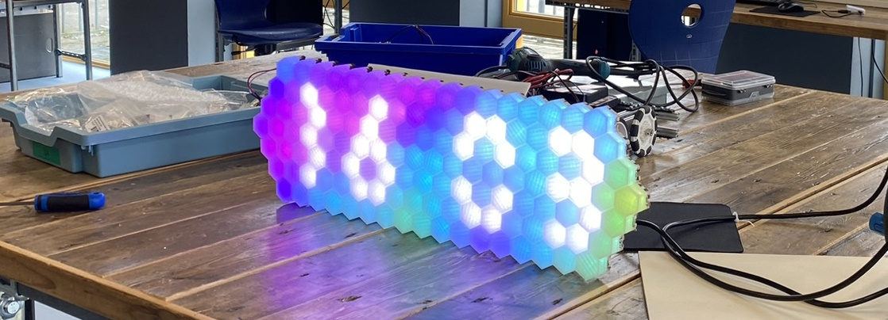
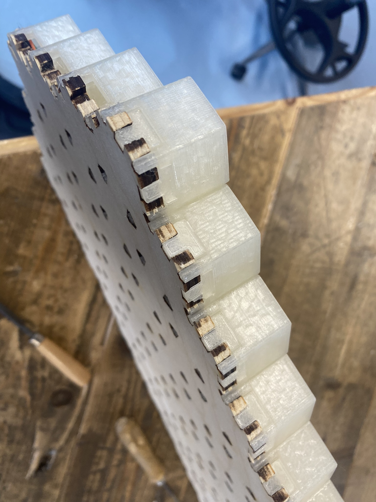
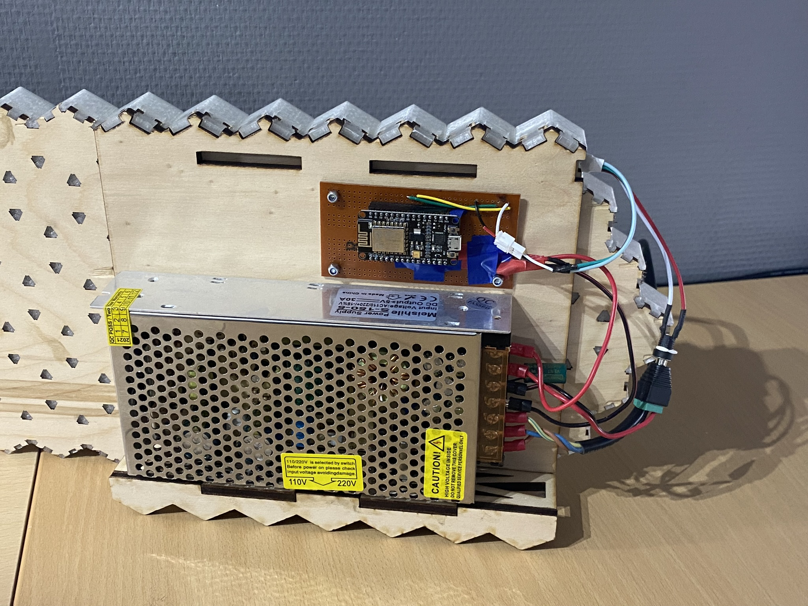

# NLT Panel

> Wij hebben voor de NLT-module "Arduino" een neopixel klok ontworpen. Met de 3D-printer hebben we hexagons gemaakt die we in een lasergesneden houten frame hebben geklikt. Op het frame zitten led-strips bevestigd die door een ESP8266 worden aangestuurd. Hierop zit zelfgemaakte software, geschreven in C++, om de juiste tijd weer te geven. Door een programma, geschreven in Rust, kunnen instellingen van de klokmodule getest worden op een 3D-model via een videostream. Hierdoor zijn er eindeloze mogelijkheden voor toekomstige weergaven op het display, zoals tekst, weereffecten en camera streams. Meer informatie over de klok is te vinden op: `https://www.prutsor.nl/nlt/panel`

## Benodigdheden

### Materialen

* [1,2 kg doorzichtig filament](https://www.prusa3d.com/product/clear-pla-filament-1kg/)
* Houten plaat van 25x70 cm
* LED-voeding van 5V (minimaal 6A)
* LED-strip van 5m (30 LED/m)
* ESP8266 NodeMCU V2

### Gereedschappen

* Lasersnijmachine
* 3D-printer

## Instructies

### Stap 1: Print de hexagons

1. Download het bestand ["print_hexagons.stl"](.github/files/print_hexagons.stl).
2. Print het bestand vijf keer.
3. Terwijl de hexagons aan het printen zijn, kun je doorgaan met de volgende stappen.

    
Optioneel: zijstukjes om de LED-kanalen te dichten

1. Download het bestand ["print_caps.stl"](.github/files/print_caps.stl).
2. Print het bestand één keer.
3. Klik de stukjes aan de zijkant van de hexagons op het bord.

    

### Stap 2: Lasersnij de houten plaat

1. Download het bestand ["backplate.svg"](.github/files/backplate.svg).
2. Open het bestand in je lasersnijprogramma.
3. Laat het lasersnijprogramma de houten plaat snijden.

### Stap 3: Bevestig de LED-strips

1. Knip de LED-strip in vijf delen: 2x17, 2x18, 2x19 en 1x20 LED's.
2. Plaats de LED-strips op de houten plaat volgens de richtingen in de afbeelding hieronder.

3. Solder de LED-strips aan elkaar.

### Stap 4: Plaats de hexagons

1. Plaats de hexagons op de houten plaat, bovenop de LED-strips.
2. Schuur de pootjes van de hexagons indien nodig.

### Stap 5: Houten standaard lasersnijden

1. Download het bestand ["mount_plate.svg"](.github/files/mount_plate.svg)
2. Open het bestand in je lasersnijprogramma
3. Laat het lasersnijprogramma de houten plaat snijden.
4. Download het bestand ["print_caps_secondary.stl"](.github/files/print_caps_secondary.stl).
5. Print het bestand één keer.
6. Zet het in elkaar zoals hieronder aangegeven.

### Stap 6: Firmware uploaden

Om de firmware op de ESP te zetten moet je eerst de volgende dingen hebben:
 * [Visual Studio Code](https://code.visualstudio.com/)
 * [PlatformIO](https://platformio.org/install/ide?install=vscode)

Na het installeren van deze programma’s moet je de repository downloaden en de `firmware` map openen in Visual Studio Code. Als je de map hebt geopend, moet je naar de `include` map gaan en het `config.example.h` bestand kopiëren naar `config.h`. In dit bestand moet je de wifi gegevens invullen. Hierbij is `ssid` de naam van het netwerk en `password` het wachtwoord van het netwerk. Verder kun je de naam van de klok eventueel aanpassen door `SERVICE_NAME` te wijzigen. Nu moet je de ESP aansluiten en op de `upload` knop klikken (hieronder aangegeven)

    

Je kunt de klok via de visualizer testen voordat je alle elektronica aansluit om te kijken of het gelukt is. De visualizer is [hier](https://github.com/Prutsor/nlt-panel-4/releases) te downloaden. Om met de klok te verbinden moet je op het verbind icoontje klikken. Daar zou je de klok moeten zien verschijnen. 

> Let op: je moet op hetzelfde WiFi-netwerk zitten als de klok om ermee te verbinden

### Stap 7: Voeg de elektronica toe

Maak de voeding en ESP vast op de plaat van de standaard. Gebruik voor de ESP eventueel een breadboard of iets dergelijks.

    

Verbind de voeding met de ESP en de ledstrip. Gebruik een kabel om de positieve en negatieve polen van de voeding te verbinden met de respectievelijke polen van de ESP en de LED-strip. Gebruik een kabel om de pin 6 van de ESP te verbinden met de data pin van de LED-strip.

